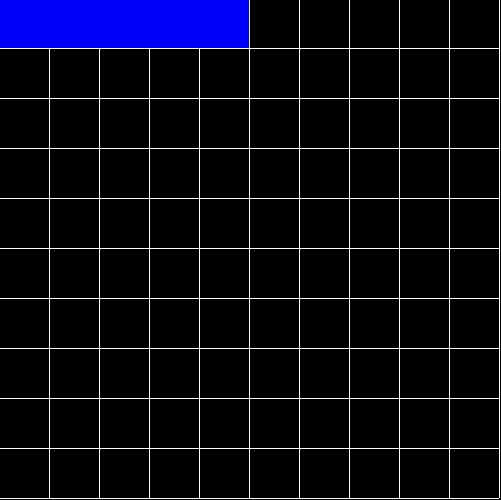

# Labyrinthe

>Labyrinthe implementation with python.
>This projects uses Randomized First-Depth search algorithm to generate the initial maze.

# Installation

Clone this repo by doing 
>git clone https://github.com/oussama1598/labyrinthe.git

Install the necessary packages using pip. The only package needed is pysdl2
>pip install pysdl2

Then you can run the program by doing
>python main.py

# Screenshots

### TODO
- [x] Implement the Randomized First-Depth search algorithm
- [ ] Implement the maze solver
